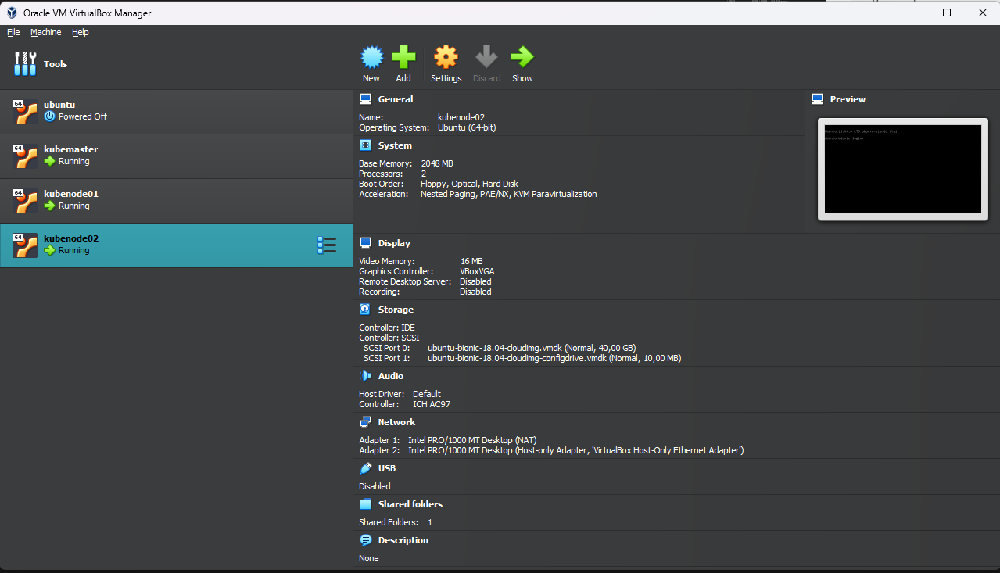
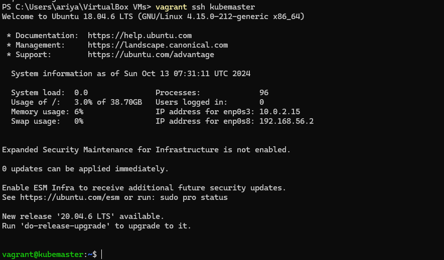
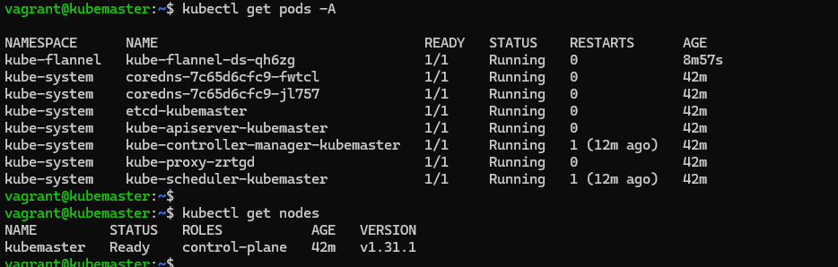

# Installing Kubernetes
---
This guide provides step-by-step instructions for installing Kubernetes Cluster with minikube and kubeadm.

## Pre-requirements
- kubectl cli
- Docker or Virtual Machine (VirtualBox)
- Vagrant

### Install kubectl with binary package
<details open>
<summary><b><font size="4">Linux</font></b></summary>
<p>

1. Download the latest release with the command :
    ```shell
    curl -LO https://storage.googleapis.com/kubernetes-release/release/$(curl -s https://storage.googleapis.com/kubernetes-release/release/stable.txt)/bin/linux/amd64/kubectl
    ```
    To download a specific version, replace the `$(curl -s https://storage.googleapis.com/kubernetes-release/release/stable.txt)` portion of the command with the specific version.
    ```shell
    curl -LO https://storage.googleapis.com/kubernetes-release/release/v1.28.0/bin/linux/amd64/kubectl
    ```
2. Make the kubectl binary executable.
    ```shell
    chmod +x ./kubectl
    ```
3. Move the binary in to your PATH.
    ```shell
    sudo mv ./kubectl /usr/local/bin/kubectl
    ```
</p>
</details>

<details open>
<summary><b><font size="4">Windows</font></b></summary>
<p>

1. Download the latest release with `PowerShell`, use this command :
    ```powershell
    New-Item -Path 'c:\' -Name 'kubectl' -ItemType Directory -Force
    Invoke-WebRequest -OutFile 'c:\kubectl\kubectl.exe' -Uri 'curl -LO https://storage.googleapis.com/kubernetes-release/release/v1.28.0/bin/windows/amd64/kubectl.exe' -UseBasicParsing
    ```
2. Add the kubectl.exe binary to your PATH (make sure to run PowerShell as Administrator).
    ```powershell
    $oldPath = [Environment]::GetEnvironmentVariable('Path', [EnvironmentVariableTarget]::Machine)
    if ($oldPath.Split(';') -inotcontains 'C:\kubectl'){
        [Environment]::SetEnvironmentVariable('Path', $('{0};C:\kubectl' -f $oldPath), [EnvironmentVariableTarget]::Machine)
    }
    ```
</p>
</details>

<details open>
<summary><b><font size="4">MacOS</font></b></summary>
<p>

1. Download the latest release with the command :
    ```shell
    curl -LO https://storage.googleapis.com/kubernetes-release/release/$(curl -s https://storage.googleapis.com/kubernetes-release/release/stable.txt)/bin/darwin/amd64/kubectl
    ```
    To download a specific version, replace the `$(curl -s https://storage.googleapis.com/kubernetes-release/release/stable.txt)` portion of the command with the specific version.
    ```shell
    curl -LO https://storage.googleapis.com/kubernetes-release/release/v1.28.0/bin/darwin/amd64/kubectl
    ```
2. Make the kubectl binary executable.
    ```shell
    chmod +x ./kubectl
    ```
3. Move the binary in to your PATH.
    ```shell
    sudo mv ./kubectl /usr/local/bin/kubectl
    ```
</p>
</details>

### Setup Docker
To setup docker, please follow this article from official docker. https://docs.docker.com/engine/install/

### Setup VirtualBox
We can download and setup the installation from this link. https://www.virtualbox.org/wiki/Download_Old_Builds_7_0

### Setup Vagrant
Please follow this link to install vagrant. https://developer.hashicorp.com/vagrant/downloads
> [!WARNING]
> Currently vagrant only support for this version of virtualbox : 4.0, 4.1, 4.2, 4.3, 5.0, 5.1, 5.2, 6.0, 6.1, 7.0

> [!CAUTION]
> For macOS with Apple Silicon, currently doesnt support for VirtualBox v7.0. So please create VM Manually

---
## Minikube

### Installing Minikube

By default, minikube will setup the kubernetes cluster as a virtual machine in VirtualBox, so, make sure you have it installed. But, for this tutorial we will use docker as main virtualization.

<details open>
<summary><b><font size="4">Linux</font></b></summary>
<p>

__Install Minikube with Binary Package :__
- To install the latest minikube stable release on x86-64 Linux using binary download:
    ```shell
    curl -LO https://storage.googleapis.com/minikube/releases/latest/minikube-linux-amd64
    sudo install minikube-linux-amd64 /usr/local/bin/minikube && rm minikube-linux-amd64
    ```

- To install the latest minikube stable release on ARM64 Linux using binary download:
    ```shell
    curl -LO https://storage.googleapis.com/minikube/releases/latest/minikube-linux-arm64
    sudo install minikube-linux-arm64 /usr/local/bin/minikube && rm minikube-linux-arm64
    ```
</p>
</details>

<details open>
<summary><b><font size="4">Windows</font></b></summary>
<p>

__Install Minikube with Binary Package :__

To install the latest minikube stable release on x86-64 Windows using .exe download :
1. Download the latest release with `PowerShell`, use this command :
    ```shell
    New-Item -Path 'c:\' -Name 'minikube' -ItemType Directory -Force
    Invoke-WebRequest -OutFile 'c:\minikube\minikube.exe' -Uri 'https://github.com/kubernetes/minikube/releases/latest/download/minikube-windows-amd64.exe' -UseBasicParsing
    ```

2. Add the minikube.exe binary to your PATH (make sure to run PowerShell as Administrator).
    ```shell
    $oldPath = [Environment]::GetEnvironmentVariable('Path', [EnvironmentVariableTarget]::Machine)
    if ($oldPath.Split(';') -inotcontains 'C:\minikube'){
        [Environment]::SetEnvironmentVariable('Path', $('{0};C:\minikube' -f $oldPath), [EnvironmentVariableTarget]::Machine)
    }
    ```
</p>
</details>

<details open>
<summary><b><font size="4">MacOS</font></b></summary>
<p>

__Install Minikube with Binary Package :__
- To install the latest minikube stable release on x86-64 macOS using binary download :
    ```shell
    curl -LO https://storage.googleapis.com/minikube/releases/latest/minikube-darwin-amd64
    sudo install minikube-darwin-amd64 /usr/local/bin/minikube
    ```

- To install the latest minikube stable release on ARM64 macOS using binary download:
    ```shell
    curl -LO https://storage.googleapis.com/minikube/releases/latest/minikube-darwin-arm64
    sudo install minikube-darwin-arm64 /usr/local/bin/minikube
    ```
</p>
</details>


---


### Check Minikube

Check few commands to verify the version installed of each CLI tool : 
```shell
minikube version
```

Expected response : 
```shell
minikube version: v1.33.0
```


---


### Create Kubernetes Cluster with minikube

To create kubernetes cluster, normally we just run this command :
```shell
minikube start --nodes 3
```

Expected response from liux :
```shell
😄  minikube v1.34.0 on Ubuntu 24.04
✨  Automatically selected the docker driver. Other choices: none, ssh
📌  Using Docker driver with root privileges
👍  Starting "minikube" primary control-plane node in "minikube" cluster
🚜  Pulling base image v0.0.45 ...
💾  Downloading Kubernetes v1.31.0 preload ...
    > preloaded-images-k8s-v18-v1...:  326.69 MiB / 326.69 MiB  100.00% 3.43 Mi
    > gcr.io/k8s-minikube/kicbase...:  487.89 MiB / 487.90 MiB  100.00% 3.46 Mi
🔥  Creating docker container (CPUs=2, Memory=2200MB) ...
🐳  Preparing Kubernetes v1.31.0 on Docker 27.2.0 ...
    ▪ Generating certificates and keys ...
    ▪ Booting up control plane ...
    ▪ Configuring RBAC rules ...
🔗  Configuring bridge CNI (Container Networking Interface) ...
🔎  Verifying Kubernetes components...
    ▪ Using image gcr.io/k8s-minikube/storage-provisioner:v5
🌟  Enabled addons: storage-provisioner, default-storageclass
🏄  Done! kubectl is now configured to use "minikube" cluster and "default" namespace by default
```

Expected response from windows :
```shell
* minikube v1.33.0 on Microsoft Windows 11 Pro 10.0.22631.4037 Build 22631.4037
* Using the docker driver based on user configuration
* Using Docker Desktop driver with root privileges
* Starting "minikube" primary control-plane node in "minikube" cluster
* Pulling base image v0.0.43 ...
* Creating docker container (CPUs=2, Memory=4000MB) ...
* minikube 1.34.0 is available! Download it: https://github.com/kubernetes/minikube/releases/tag/v1.34.0
* To disable this notice, run: 'minikube config set WantUpdateNotification false'

! Executing "docker ps -a --format {{.Names}}" took an unusually long time: 3.1577222s
* Restarting the docker service may improve performance.
* Preparing Kubernetes v1.30.0 on Docker 26.0.1 ...
  - Generating certificates and keys ...
  - Booting up control plane ...
  - Configuring RBAC rules ...
* Configuring bridge CNI (Container Networking Interface) ...
* Verifying Kubernetes components...
  - Using image gcr.io/k8s-minikube/storage-provisioner:v5
* Enabled addons: storage-provisioner, default-storageclass

! C:\Program Files\Docker\Docker\resources\bin\kubectl.exe is version 1.28.2, which may have incompatibilities with Kubernetes 1.30.0.
  - Want kubectl v1.30.0? Try 'minikube kubectl -- get pods -A'
* Done! kubectl is now configured to use "minikube" cluster and "default" namespace by default
```

That command will create a Docker with 2CPU and 1/4 of total memory by default. And by default, the installed Kubernetes version is the latest version of the current stable Kubernetes.

__What if i want to create kubernetes cluster with specific kubernetes version ?__

- We can use `--kubernetes-version` flag to select the version of kubernetes to be installed.

__What if i want to create kubernetes cluster but with specific CPU or Memory ?__

- We can use `--cpus` to set how much the cpu we want to use
  and / or
- We can use `--memory` to set how much the memory we want to use

If we intend to use such local Docker repo then we must specify it at the minikube cluster creation time because a later update of this element will not be possible.

To check if the cluster is created run this command :
```shell
minikube status
```

Expected response :
```shell
minikube
type: Control Plane
host: Running
kubelet: Running
apiserver: Running
kubeconfig: Configured
```

After the cluster was created, now we can interact with the cluster with `kubectl`. 

#### Modify options to the minikube

To make it easier for us to operate the cluster we can enable some addons :
- dashboard - a GUI to browse and managa components of the kubernetes cluster
- ingress - a functionality of kubernetes that allow to expose the services running in the cluster

Both these options are provided as 'addons' in minikube and can be enable with : `minikubea addons enable <addons_name>`

We can list all addons with : `minikube addons list`


|         ADDON NAME          | PROFILE  |    STATUS    |           MAINTAINER           |
|-----------------------------|----------|--------------|--------------------------------|
| ambassador                  | minikube | disabled     | 3rd party (Ambassador)         |
| auto-pause                  | minikube | disabled     | minikube                       |
| cloud-spanner               | minikube | disabled     | Google                         |
| csi-hostpath-driver         | minikube | disabled     | Kubernetes                     |
| dashboard                   | minikube | disabled     | Kubernetes                     |
| default-storageclass        | minikube | enabled ✅   | Kubernetes                     |
| efk                         | minikube | disabled     | 3rd party (Elastic)            |
| freshpod                    | minikube | disabled     | Google                         |
| gcp-auth                    | minikube | disabled     | Google                         |
| gvisor                      | minikube | disabled     | minikube                       |
| headlamp                    | minikube | disabled     | 3rd party (kinvolk.io)         |
| helm-tiller                 | minikube | disabled     | 3rd party (Helm)               |
| inaccel                     | minikube | disabled     | 3rd party (InAccel             |
|                             |          |              | [info@inaccel.com])            |
| ingress                     | minikube | disabled     | Kubernetes                     |
| ingress-dns                 | minikube | disabled     | minikube                       |
| inspektor-gadget            | minikube | disabled     | 3rd party                      |
|                             |          |              | (inspektor-gadget.io)          |
| istio                       | minikube | disabled     | 3rd party (Istio)              |
| istio-provisioner           | minikube | disabled     | 3rd party (Istio)              |
| kong                        | minikube | disabled     | 3rd party (Kong HQ)            |
| kubeflow                    | minikube | disabled     | 3rd party                      |
| kubevirt                    | minikube | disabled     | 3rd party (KubeVirt)           |
| logviewer                   | minikube | disabled     | 3rd party (unknown)            |
| metallb                     | minikube | disabled     | 3rd party (MetalLB)            |
| metrics-server              | minikube | disabled     | Kubernetes                     |
| nvidia-device-plugin        | minikube | disabled     | 3rd party (NVIDIA)             |
| nvidia-driver-installer     | minikube | disabled     | 3rd party (Nvidia)             |
| nvidia-gpu-device-plugin    | minikube | disabled     | 3rd party (Nvidia)             |
| olm                         | minikube | disabled     | 3rd party (Operator Framework) |
| pod-security-policy         | minikube | disabled     | 3rd party (unknown)            |
| portainer                   | minikube | disabled     | 3rd party (Portainer.io)       |
| registry                    | minikube | disabled     | minikube                       |
| registry-aliases            | minikube | disabled     | 3rd party (unknown)            |
| registry-creds              | minikube | disabled     | 3rd party (UPMC Enterprises)   |
| storage-provisioner         | minikube | enabled ✅   | minikube                       |
| storage-provisioner-gluster | minikube | disabled     | 3rd party (Gluster)            |
| storage-provisioner-rancher | minikube | disabled     | 3rd party (Rancher)            |
| volumesnapshots             | minikube | disabled     | Kubernetes                     |
| yakd                        | minikube | disabled     | 3rd party (marcnuri.com)       |

#### Explore the cluster

The CLI tool kubectl is used to explore and manage the cluster. The following command will show the only node composing the cluster :
```shell
kubectl get nodes
NAME       STATUS   ROLES           AGE   VERSION
minikube   Ready    control-plane   32m   v1.30.0
```

The following command will show all components in the default namespace :
```shell
kubectl get all
```

To get all namespace, we can use this command : 
```shell
kubectl get ns
```

#### Fix coredns
In some cases you may need to get from a pod to an Internet address. You may discover that the external address is not accessible due to K8s DNS initial settings done by Minikube.

In this case you will have to check the coredns configuration with :
```shell
kubectl -n kube-system edit configmaps coredns
```

The configmap may look like this : 
```yaml
apiVersion: v1
data:
  Corefile: |
    .:53 {
        log
        errors
        health {
           lameduck 5s
        }
        ready
        kubernetes cluster.local in-addr.arpa ip6.arpa {
           pods insecure
           fallthrough in-addr.arpa ip6.arpa
           ttl 30
        }
        prometheus :9153
        hosts {
           192.168.49.1 host.minikube.internal
           fallthrough
        }
        forward . /etc/resolv.conf {
           max_concurrent 1000
        }
        cache 30
        loop
        reload
        loadbalance
    }
kind: ConfigMap
metadata:
  creationTimestamp: "2024-10-12T12:29:43Z"
  name: coredns
  namespace: kube-system
  resourceVersion: "271"
  uid: 326e33c0-89bc-4087-b7ea-d90019852ef7
```

All you need is to change the forward section as follows:
```yaml
        forward . 8.8.8.8:53 {
           max_concurrent 1000
        }
```

### Add new node
If we want to add some node, we can use this command : 
```shell
minikube node add
```

Just like when you first initiate a cluster, minikube will download some required dependencies.

### Start/Stop cluster

>:exclamation: The cluster will be started and stopped **ONLY** using minikube CLI tool.
>
>:exclamation: If using virtualbox, **Do not** start or stop the VM using VirtualBox.

- The cluster will be started with:

```shell
minikube start
```

- The cluster will be stopped with:

```shell
minikube stop
```

### Other minikube commands
We will get all options of minikube if you run:

```shell
minikube
```

Few useful comands follows:

- Display the IP address of the Kubernetes minikube Docker / VM.
```shell
$ minikube ip

192.168.99.100
```

- Display the logs of cluster components.
```shell
minikube logs
```
- Login to the VM with user docker. The user has sudo rights.
```shell
minikube ssh
```

### Delete Kubernetes Cluster

If we want to delete the Minikube cluster entirely, you can do so with :
```shell
minikube delete --all
```

---

## Kubeadm

### Setup Virtual Machine

For a quick start, we'll bring up virtual machines VirtualBox because it is free and works on all major platforms.
We will build our virtual environment from Vagrantfile. Clone this repo or just copy this [Vagrantfile](Vagrantfile) to your current directory (Reference: [kodekloudhub](https://github.com/kodekloudhub/certified-kubernetes-administrator-course)).

Vagrantfile : 
```shell
# -*- mode: ruby -*-
# vi:set ft=ruby sw=2 ts=2 sts=2:

# Define the number of control plane (MASTER_NODE) and node (WORKER_NODE)
NUM_MASTER_NODE = 1
NUM_WORKER_NODE = 2

IP_NW = "192.168.56."
MASTER_IP_START = 1
NODE_IP_START = 2

# All Vagrant configuration is done below. The "2" in Vagrant.configure
# configures the configuration version (we support older styles for
# backwards compatibility). Please don't change it unless you know what
# you're doing.

Vagrant.configure("2") do |config|

# The most common configuration options are documented and commented below.
# For a complete reference, please see the online documentation at
# https://docs.vagrantup.com.

# Every Vagrant development environment requires a box. You can search for
# boxes at https://vagrantcloud.com/search.
# Here are some key details about the "ubuntu/bionic64" Vagrant box:
    # Operating System: Ubuntu 18.04 LTS (Bionic Beaver)
        # Ubuntu 18.04 LTS will receive security updates and bug fixes 
        # from Canonical, the company behind Ubuntu, until April 2023 
        # for desktop and server versions, and until April 2028 for 
        # server versions with Extended Security Maintenance (ESM) enabled.
    # Architecture: x86_64 (64-bit)
    # Disk Size: 10 GB
    # RAM: 2 GB
    # CPUs: 2
    # Desktop Environment: None (headless)
    # Provider: VirtualBox
    
config.vm.box = "ubuntu/bionic64"

# Disable automatic box update checking. If you disable this, then
# boxes will only be checked for updates when the user runs
# `vagrant box outdated`. This is not recommended.
config.vm.box_check_update = false

# View the documentation for the VirtualBox for more
# information on available options.
# https://developer.hashicorp.com/vagrant/docs/providers/virtualbox/configuration

# Provision Control Plane
(1..NUM_MASTER_NODE).each do |i|
    config.vm.define "kubemaster" do |node|
        node.vm.provider "virtualbox" do |vb|
            vb.name = "kubemaster"
            vb.memory = 2048
            vb.cpus = 2
        end
        node.vm.hostname = "kubemaster"
        node.vm.network :private_network, ip: IP_NW + "#{MASTER_IP_START + i}"
    end
end


# Provision Nodes
(1..NUM_WORKER_NODE).each do |i|
    config.vm.define "kubenode0#{i}" do |node|
        node.vm.provider "virtualbox" do |vb|
            vb.name = "kubenode0#{i}"
            vb.memory = 2048
            vb.cpus = 2
        end
        node.vm.hostname = "kubenode0#{i}"
        node.vm.network :private_network, ip: IP_NW + "#{NODE_IP_START + i}"
    end
end
end
```

In this Vagrantfile, we specify: 
- A number of virtual machines: `NUM_MASTER_NODE`, `NUM_WORKER_NODE`
- IP address: `IP_NW`, `MASTER_IP_START`, `NODE_IP_START`
- Private networking connectivity: `node.vm.network`
- Unique hostname: `node.vm.hostname`
- Operating system: `config.vm.box`
- System resources: `vb.memory`, `vb.cpus`


#### Start Provisioning
To start provisioning, run this command and dong forget to make sure the `Vagrantfile` is same when we run the command : 
```shell
vagrant up
```

Expected response : 
```shell
Bringing machine 'kubemaster' up with 'virtualbox' provider...
Bringing machine 'kubenode01' up with 'virtualbox' provider...
Bringing machine 'kubenode02' up with 'virtualbox' provider...
==> kubemaster: Box 'ubuntu/bionic64' could not be found. Attempting to find and install...
    kubemaster: Box Provider: virtualbox
    kubemaster: Box Version: >= 0
==> kubemaster: Loading metadata for box 'ubuntu/bionic64'
    kubemaster: URL: https://vagrantcloud.com/api/v2/vagrant/ubuntu/bionic64
==> kubemaster: Adding box 'ubuntu/bionic64' (v20230607.0.3) for provider: virtualbox
    kubemaster: Downloading: https://vagrantcloud.com/ubuntu/boxes/bionic64/versions/20230607.0.3/providers/virtualbox/unknown/vagrant.box
Download redirected to host: cloud-images.ubuntu.com
    kubemaster:
==> kubemaster: Successfully added box 'ubuntu/bionic64' (v20230607.0.3) for 'virtualbox'!
==> kubemaster: Importing base box 'ubuntu/bionic64'...
==> kubemaster: Matching MAC address for NAT networking...
==> kubemaster: Setting the name of the VM: kubemaster
```

To check status of provisioning, we can use command :
```shell
vagrant status
```

Expected response :
```shell
Current machine states:

kubemaster                running (virtualbox)
kubenode01                running (virtualbox)
kubenode02                running (virtualbox)

This environment represents multiple VMs. The VMs are all listed
above with their current state. For more information about a specific
VM, run `vagrant status NAME`.
```

And when we see in virtualbox window, the created instance will be show


#### Remote to Virtual Machine

To access ssh remote to virtual machine, we just run this command :
```shell
vagrant ssh <hostname>
```



#### Installing The Docker Container Runtime on VM

To installing the docker container runtime, pleas follow this step in [Pre-requirements](#Pre-requirements)

##### Additional Step
In this tutorial we will use docker as the main container runtime, so we have to install and setup cri-dockerd for kubernetes to work properly.

1. Download and extract the `cri-dockerd` package with this command :
    ```shell
    wget https://github.com/Mirantis/cri-dockerd/releases/download/v0.3.15/cri-dockerd-0.3.15.amd64.tgz
    tar -xvzf cri-dockerd-0.3.15.amd64.tgz
    ```
2. And move the `cri-dockerd` package to `/usr/local/bin/` directory :
    ```shell
    sudo mv cri-dockerd/cri-dockerd /usr/local/bin/
    ```
3. Download systemd configuration template and replace `/usr/bin/cri-dockerd` to `/usr/local/bin/cri-dockerd` :
    ```shell
    wget https://raw.githubusercontent.com/Mirantis/cri-dockerd/master/packaging/systemd/cri-docker.service
    wget https://raw.githubusercontent.com/Mirantis/cri-dockerd/master/packaging/systemd/cri-docker.socket
    sudo mv cri-docker.socket cri-docker.service /etc/systemd/system/
    sudo sed -i -e 's,/usr/bin/cri-dockerd,/usr/local/bin/cri-dockerd,' /etc/systemd/system/cri-docker.service
    ```
4. And start the service with cri-dockerd enabled :
    ```shell
    sudo systemctl daemon-reload
    sudo systemctl enable cri-docker.service
    sudo systemctl enable --now cri-docker.socket
    ```
5. To verify that the service is running with :
   ```shell
   sudo systemctl status cri-docker.socket
   ```

---


### Setup kubeadm, kubelet, and kubectl

#### Ports and Protocols

When running Kubernetes in an environment with strict network boundaries, such as on-premises datacenter with physical network firewalls or Virtual Networks in Public Cloud, it is useful to be aware of the ports and protocols used by Kubernetes components.

__Control Plane :__
| Protocol | Direction | Port Range | Purpose | Used By |
|----------|-----------|------------|---------|---------|
| TCP      | Inbound   | 6443       | Kubernetes API Server | All |
| TCP      | Inbound   | 2379 - 2380 | etcd server client API | kube-apiserver, etcd |
| TCP      | Inbound   | 10250      | Kubelet API | Self, Control Plane |
| TCP      | Inbound   | 10259      | kube-scheduler | Self
| TCP      | Inbound   | 10257      | kube-controller-manager | Self

__Worker Nodes :__
| Protocol | Direction | Port Range | Purpose | Used By |
|----------|-----------|------------|---------|---------|
| TCP      | Inbound   | 10250      | Kubelet API | Self, Control Plane |
| TCP      | Inbound   | 10256      | kube-proxy | Self, Control Plane |
| TCP      | Inbound   | 30000 - 23767 | NodePort Services | All

#### Installing kubeadm, kubelet, and kubectl
<p align="center">

</p>

Kubeadm is a command-line tool for bootstrapping a Kubernetes cluster. It is part of the official Kubernetes distribution and is designed to simplify the process of setting up a new Kubernetes cluster. Kubeadm automates many of the tasks involved in setting up a cluster, such as configuring the control plane components, generating TLS certificates, and setting up the Kubernetes networking.

>One of the key areas covered in the `Certified Kubernetes Administrator (CKA)` exam is cluster setup, which includes using tools like Kubeadm to bootstrap a new Kubernetes cluster.

In kubernetes, especially with kubeadm there is 3 main component What we have to install includes :
- kubelet
  The component that runs on all of the machines in your cluster and does things like starting pods and containers.
- kubeadm
  Install the rest components of kubernetes cluster
- kubectl
  The command line util to talk to your cluster


__Update the `apt package index` and install `packages` needed to use the `Kubernetes apt repository`:__
```shell
sudo apt update
sudo apt install -y apt-transport-https ca-certificates curl gpg
```

__Download the Google Cloud public signing key :__
```shell
sudo mkdir -m 0755 -p /etc/apt/keyrings
curl -fsSL https://pkgs.k8s.io/core:/stable:/v1.31/deb/Release.key | sudo gpg --dearmor -o /etc/apt/keyrings/kubernetes-apt-keyring.gpg
```

__Add the Kubernetes apt repository :__
```shell
echo 'deb [signed-by=/etc/apt/keyrings/kubernetes-apt-keyring.gpg] https://pkgs.k8s.io/core:/stable:/v1.31/deb/ /' | sudo tee /etc/apt/sources.list.d/kubernetes.list
```

__Update apt package index again, install kubelet, kubeadm and kubectl, pin their version to avoid auto-upgrade :__
```shell
sudo apt update
sudo apt install -y kubelet kubeadm kubectl
sudo apt-mark hold kubelet kubeadm kubectl
```

#### Initialize Control Plane

The control-plane node is the machine where the control plane components run, including etcd (the cluster database) and the API Server (which the kubectl command line tool communicates with).

- (Recommended) If you have plans to upgrade this single control-plane kubeadm cluster to high availability you should specify the --control-plane-endpoint to set the shared endpoint for all control-plane nodes. Such an endpoint can be either a DNS name or an IP address of a load-balancer.
- Choose a Pod network add-on, and verify whether it requires any arguments to be passed to kubeadm init. Depending on which third-party provider you choose, you might need to set the --pod-network-cidr to a provider-specific value. See Installing a Pod network add-on.
- (Optional) kubeadm tries to detect the container runtime by using a list of well known endpoints. To use different container runtime or if there are more than one installed on the provisioned node, specify the --cri-socket argument to kubeadm. See Installing a runtime.

To initialize the control plane, run this command in your virtual machine hostname kubemaster :
```shell
sudo kubeadm init --apiserver-advertise-address=192.168.56.2 --pod-network-cidr=100.96.0.0/16
```

- `--apiserver-advertise-address=192.168.56.2`: The IP address the API Server will advertise its listening on. In this tutorial, we will use the IP address of `kubemaster` VM.
- `--pod-network-cidr=100.96.0.0/16`: the control plane will automatically allocate CIDRs for every node which specifies a range of IP addresses that can be used for pod IPs. **You may need to choose a CIDR range that does not overlap with any existing network ranges to avoid IP address conflicts**.

`kubeadm init` first runs a series of prechecks to ensure that the machine is ready to run `Kubernetes`. These prechecks expose warnings and exit on errors. `kubeadm init` then downloads and installs the cluster control plane components. This may take several minutes. After it finishes you should see :
```shell
Your Kubernetes control-plane has initialized successfully!

To start using your cluster, you need to run the following as a regular user:

  mkdir -p $HOME/.kube
  sudo cp -i /etc/kubernetes/admin.conf $HOME/.kube/config
  sudo chown $(id -u):$(id -g) $HOME/.kube/config

Alternatively, if you are the root user, you can run:

  export KUBECONFIG=/etc/kubernetes/admin.conf

You should now deploy a pod network to the cluster.
Run "kubectl apply -f [podnetwork].yaml" with one of the options listed at:
  https://kubernetes.io/docs/concepts/cluster-administration/addons/

Then you can join any number of worker nodes by running the following on each as root:

kubeadm join <control-plane-host>:<control-plane-port> --token <token> --discovery-token-ca-cert-hash sha256:<hash>
```

##### Install Pod Network Add-on

Run `kubectl get nodes` on control-plane to verify the control plane status
```shell
kubectl get nodes
NAME         STATUS     ROLES           AGE   VERSION
kubemaster   NotReady   control-plane   21m   v1.31.1
```

As you can see, the kubernetes cluster was created bu our virtual machine `kubemaster` status are `NotReady`. This happens beacuse there is no `Container Network Interface (CNI)` in cluster so that each pod can communicate with other pods, to deploy it we can use this command : 
```shell
wget -qO- https://github.com/flannel-io/flannel/releases/latest/download/kube-flannel.yml | sed -e 's/10.244.0.0/100.96.0.0/g' | kubectl apply -f -
```

The command will launch a daemonset named kube-flannel in the kube-flannel namespace. When the pod runs, the status of the kubemaster VM will immediately change from `NotReady` to `Ready`.



##### Certificate Management with kubeadm
By default, kubeadm generates all the certificates needed for a cluster to run when `kubeadm init` process. Client certificates generated by kubeadm  will be expire after 1 year. To check it, we can use this command : 
```shell 
kubeadm certs check-expiration
```
The output is similar to this :
```shell
[check-expiration] Reading configuration from the cluster...
[check-expiration] FYI: You can look at this config file with 'kubectl -n kube-system get cm kubeadm-config -o yaml'

CERTIFICATE                EXPIRES                  RESIDUAL TIME   CERTIFICATE AUTHORITY   EXTERNALLY MANAGED
admin.conf                 Oct 13, 2025 09:58 UTC   364d            ca                      no
apiserver                  Oct 13, 2025 09:58 UTC   364d            ca                      no
apiserver-etcd-client      Oct 13, 2025 09:58 UTC   364d            etcd-ca                 no
apiserver-kubelet-client   Oct 13, 2025 09:58 UTC   364d            ca                      no
controller-manager.conf    Oct 13, 2025 09:58 UTC   364d            ca                      no
etcd-healthcheck-client    Oct 13, 2025 09:58 UTC   364d            etcd-ca                 no
etcd-peer                  Oct 13, 2025 09:58 UTC   364d            etcd-ca                 no
etcd-server                Oct 13, 2025 09:58 UTC   364d            etcd-ca                 no
front-proxy-client         Oct 13, 2025 09:58 UTC   364d            front-proxy-ca          no
scheduler.conf             Oct 13, 2025 09:58 UTC   364d            ca                      no
super-admin.conf           Oct 13, 2025 09:58 UTC   364d            ca                      no

CERTIFICATE AUTHORITY   EXPIRES                  RESIDUAL TIME   EXTERNALLY MANAGED
ca                      Oct 11, 2034 09:58 UTC   9y              no
etcd-ca                 Oct 11, 2034 09:58 UTC   9y              no
front-proxy-ca          Oct 11, 2034 09:58 UTC   9y              no
```

The command shows expiration/residual time for the client certificates in the /etc/kubernetes/pki folder and for the client certificate embedded in the kubeconfig files used by kubeadm (admin.conf, controller-manager.conf and scheduler.conf).

Additionally, kubeadm informs the user if the certificate is externally managed; in this case, the user should take care of managing certificate renewal manually/using other tools.

__Manual certificate renewal__
We can renew the certificates manually at any time with the `kubeadm certs renew` command, with the appropriate command line options. If we are running cluster with a replicated control plane, this command needs to be executed on all the control-plane nodes.

__Automatic certificate renewal__
Kubeadm only renew all the certificate during control plane upgrade.


#### Join Worker Node

Run the command that was output by kubeadm init on all worker nodes - virtual machine:kubenode01, kubenode02with sudo permission :
```shell
sudo kubeadm join --token <token> <control-plane-host>:<control-plane-port> --discovery-token-ca-cert-hash sha256:<hash>
```

__If we lost the output command above, go to the control plane: `kubemaster`.__

__Get the `<token>` by running__
```shell
kubeadm token list
```

Expected response will similar like this :
```shell
TOKEN                     TTL         EXPIRES                USAGES                   DESCRIPTION                                                EXTRA GROUPS
gsoxgm.mabczoxvgksey6u8   23h         2024-10-14T10:00:05Z   authentication,signing   The default bootstrap token generated by 'kubeadm init'.   system:bootstrappers:kubeadm:default-node-token
```

By default, `<tokens>` expire after 24 hours. If you are joining a node to the cluster after the current `<token>` has expired, you can create a new `<token>` by running the following command on the `control-plane node`:
```shell
kubeadm token create
```

Expected response : 
```shell
np8qoy.dc5loz1w6dyv9tn4
```

__To get the <hash> by running__
```shell
openssl x509 -pubkey -in /etc/kubernetes/pki/ca.crt | openssl rsa -pubin -outform der 2>/dev/null | \
openssl dgst -sha256 -hex | sed 's/^.* //'
```
The output is similar to :
```shell
f6f657e7f68f03d03c74f43fd1fd665f5ea462f6d3d29b06c41bb8f45f16ab8a
```

__To get the <control-plane-host>:<control-plane-port> by running__
```shell
cat /$HOME/.kube/config | grep server
```
The outpu is similar to : 
```shell
    server: https://192.168.56.2:6443
```

So, to join we can use the command based on previous information like this :
```shell
sudo kubeadm join 192.168.56.2:6443 --token gsoxgm.mabczoxvgksey6u8 --discovery-token-ca-cert-hash sha256:f6f657e7f68f03d03c74f43fd1fd665f5ea462f6d3d29b06c41bb8f45f16ab8a --cri-socket=/var/run/cri-dockerd.sock
```
Expected response :
```shell
[preflight] Reading configuration from the cluster...
[preflight] FYI: You can look at this config file with 'kubectl -n kube-system get cm kubeadm-config -o yaml'
[kubelet-start] Writing kubelet configuration to file "/var/lib/kubelet/config.yaml"
[kubelet-start] Writing kubelet environment file with flags to file "/var/lib/kubelet/kubeadm-flags.env"
[kubelet-start] Starting the kubelet
[kubelet-check] Waiting for a healthy kubelet at http://127.0.0.1:10248/healthz. This can take up to 4m0s
[kubelet-check] The kubelet is healthy after 504.835012ms
[kubelet-start] Waiting for the kubelet to perform the TLS Bootstrap

This node has joined the cluster:
* Certificate signing request was sent to apiserver and a response was received.
* The Kubelet was informed of the new secure connection details.

Run 'kubectl get nodes' on the control-plane to see this node join the cluster.
```

New node will added to cluster :
```shell
kubectl get nodes
NAME         STATUS   ROLES           AGE    VERSION
kubemaster   Ready    control-plane   176m   v1.31.1
kubenode01   Ready    <none>          66m    v1.31.1
kubenode02   Ready    <none>          60m    v1.31.1
```

#### Disable SWAP

Swap must be disabled for the kubelet work properly